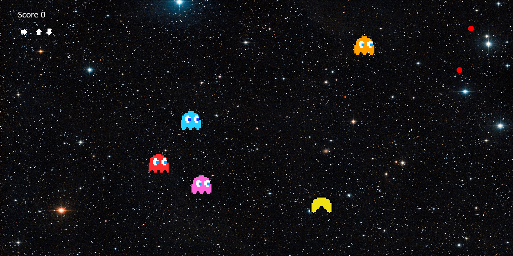
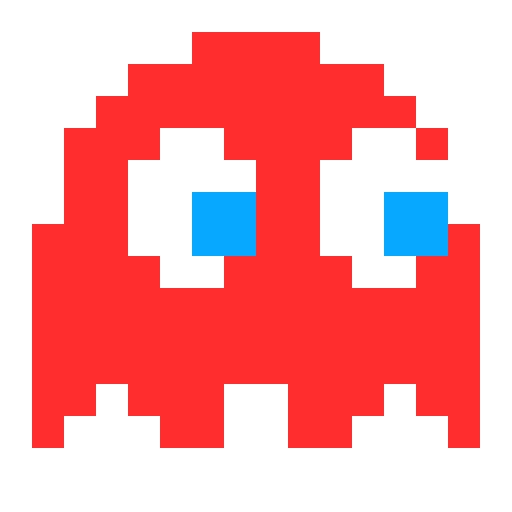
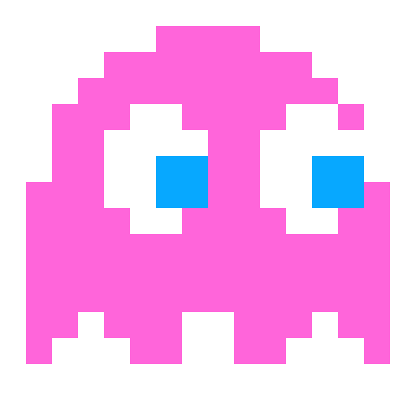
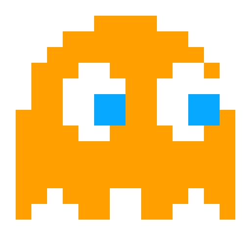

# Jeu de gestion - Python 
Jeu réalisé dans le cadre d'un apprentissage en CDA 

# 👾 Contexte
Pac-man space
Le joueur doit contrôler Pac-man pour éviter les Fantômes et récuperer un maximum de pac-gommes avec une difficulté croissante.

# 🚀 Fonctionnalités
- Chaque Fantôme possède son propre comportement :
    -  **Blinky :** suit le joueur
    -  **Pinky :** essaie de bloquer la route au joueur
    -  **Inky :** suit le joueur mais évite les autres fantômes
    -  **Clyde :** bouge aléatoirement et tend à aller vers le centre desfois

- Chaque pac-gomme augmente le score et légèrement la vitesse des fantômes et aussi du joueur 
- Animation des fantômes et du Pac-man
- Animation des yeux des fantômes en fonction de la direction
- Le joueur se déplace avec les flèches du clavier
- Le joueur peut réaliser des inputs spéciaux :
    - **🡆 + 🡅 + 🡆 + 🡅 (ou autre diagonales) :** pour se déplacer en diagonale avec un léger boost de vitesse
    - **🡄 + 🡄 + 🡆 (ou autre séquences) :** pour se déplacer plus vite

# 🔮 Améliorations possibles
- Ajouter une vue d’aide affichant les contrôles et les combinaisons spéciales.
- Intégrer un système d’attaque permettant de vaincre les fantômes.
- Créer un téléporteur pour traverser les bords de l’écran.
- Ajouter des items bonus donnant des avantages temporaires.
- Mettre en place un écran de fin de partie.
- Sauvegarder en ligne le score du joueur, un leaderboard et des statistiques globales (moyenne des scores, nombre de parties, etc.).

